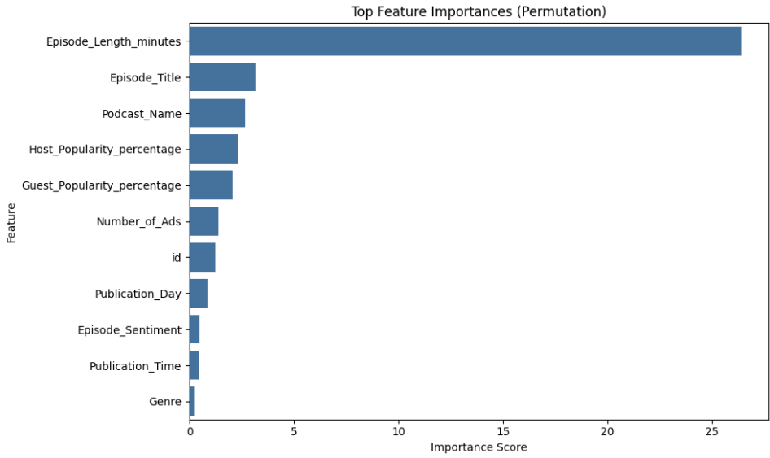
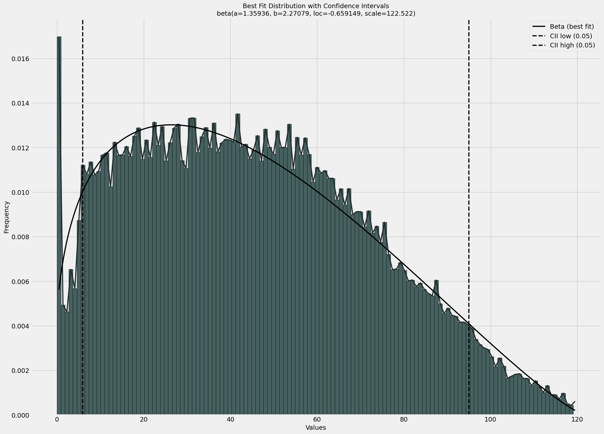

## 1. t-SNE 

*t-SNE* is a nonlinear dimensionality reduction technique helpful for visualizing high-dimensional data. 


### Algorithm Review
*t-SNE* begins by computing the pairwise similarities between points $x_i$ and $x_j$ in the original dataset, based on a Gaussian distribution. That is, it finds the conditional probability that $x_i$ picks $x_j$ as its neighbor (and vice-versa), and these probabilities are "symmetrized" to obtain similarities $p_{ij}$. Similarly, it finds the similarities $q_{ij}$ in the low-dimensional space via a Student's t-distribution (one degree of freedom) between $y_i$ and $y_j$. 

The algorithm minimizes the Kullback–Leibler (KL) divergence between the high- and low-dimensional distributions:

```math
\text{KL}(P \| Q) = \sum_{i \ne j} p_{ij} \log \left( \frac{p_{ij}}{q_{ij}} \right)
```

And the loss is minimized via gradient descent. 

### Demo 

<p align="center">
  
</p>

### Guide to Usage 

**Classification**: In a classification task, t-SNE is ideal. We can use different colors for each class. If, in the lower dimension, each class forms a distinct cluster, then the classes are well-separated in the feature space. Otherwise, those classes are hard to separate, there may exist noise, and a model may struggle in those regions. Crucially, if there exists overlap, do not use linear models. 

**Regression**: In a regression task, there's no class labels, but we can color each point in the t-SNE plot by its target value using a color gradient (e.g. blue to red). If there's smooth transitions between colors, there exists structure in the learned low-dimensional representations. Otherwise, the features may not explain the target variable well. To follow it up, we can compute an $R^2$ to measure the variance explained by the model. 

**Other ideas**: Instead of mapping the encoded y-variable, we can map our predictions and/or residuals for other interpretations. 

### Caveats

**Time Complexity**: t-SNE is quadratic (really really slow) in terms of its sample size. Even for $n=50,000$, it'll take a few minutes to fully plot. If the dataset has ~1 million data points, it'll take hours, and for anything greater we should just consider a sample. 

Global Structure: t-SNE prefers local structure over global structure. That is, the distances between clusters in the low-dimensional space are effectively meaningless. 

# AutoGluon & Feature Importance

AutoGluon is an AutoML kit made by AWS. It makes really good models, automatically. As in, it automates data pre-processing, model selection, hyperparameter tuning, and ensembling, all within ~3 lines of code. It supports tabular, image, time series, and text data modalities. 

### Traditional vs. AutoGluon


| Step                     | Traditional ML Effort     | AutoGluon              |
|--------------------------|----------------------------|-------------------------|
| Data preprocessing       | Manual & time-consuming    | ✅ Done automatically   |
| Model selection          | Trial-and-error            | ✅ Dozens trained       |
| Hyperparameter tuning    | Grid search/manual         | ✅ Automatic search     |
| Ensembling               | Advanced technique         | ✅ Built-in             |
| Cross-validation         | Manual split               | ✅ Automated            |
| Interpretability         | Requires setup        | ✅ Built-in             |
| Saving/loading models    | Extra code                 | ✅ Easy commands        |

### Permutation Importances 

By calling `predictor.feature_importance(data)
`, we can assess the usefulness of features in the original dataset. When we do this, Autogluon...

1. Evaluates the model's performance on the original data on a given metric  
2. For each feature, shuffles its values, and measures the drop in performance on the same data
3. Computes importance of that feature

### Visualizing Importance 

<p align="center">
  
</p>

# Distfit

We can use the `distfit` library to automatically fit a theoretical/named distribution to our target variable (or even just a single column from our training set). 

<p align="center">
  
</p>

NOTE: `distfit` lets you fit the entire 2D array X, but I found that this computationally infeasible even for small datasets. 


